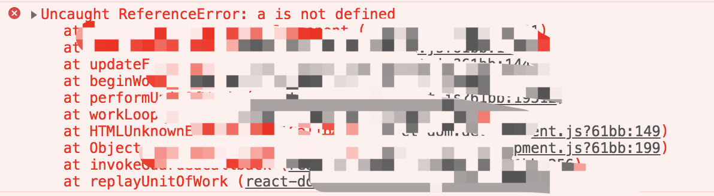
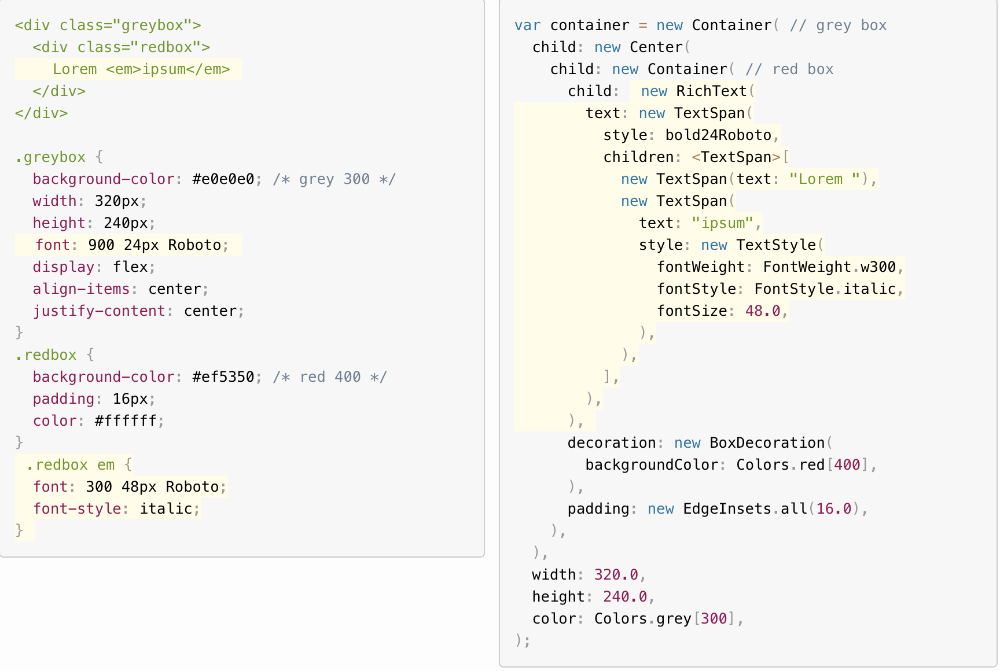

## Flutter 食髓知味

### 移动开发演变

1. 原生开发

&ensp;&ensp;&ensp;早期针对各平台（操作系统差异），使用相应平台支持的开发语言，开发应用。就 ios 和 android 两大阵营来讲，需要两套代码来实现一款应用，生产效率相对较低。

2. 混合开发（Hybrid）

&ensp;&ensp;&ensp;H5 技术的出现，为 web 运行在原生应用中提供了更好的支持。webview + jsBridge 让 web 开发者也能够开发原生应用，并且一套代码适配两端。

3. 原生渲染

&ensp;&ensp;&ensp;前端框架群雄逐鹿，React 社区推出了 React-Native ，通过 JS 控制原生控件，同样做到了适配两端，但性能依然是瓶颈，JS 语言成为了限制所在。

4. 自制 UI 引擎

&ensp;&ensp;&ensp;吸收其他框架所长，自制 UI 引擎。Flutter 使用 dart 语言开发，静态类型，编译型语言，AOT 让运行时速度更快。既不使用 webview 也不使用操作系统原生控件， 自制 UI 引擎，可以保证在 android 和 ios 的一致性。

### Flutter UI

#### 绘图原理

&ensp;&ensp;&ensp;一切前端编码都是 GUI 编程，即针对于操作系统硬件绘图能力的应用。

```
     UI (用户界面)
        /\
        ||
        GPU
        /\
        ||
        CPU
```

&ensp;&ensp;&ensp;用户界面由大量的显像单元组成，每个像素点的颜色构成了整个视图界面。我们通过编码来控制像素点色号，从而控制视图成像。编码发出系统指令，CPU 首先根据指令计算内容数据，再交由 GPU 生成每个像素点的色彩数据，最终输出给显像单元呈色。

&ensp;&ensp;&ensp;flutter 在原生应用平台之上构建了一套完整的 UI 系统，调用 [OpenGL](https://baike.baidu.com/item/OpenGL/238984?fr=aladdin) 库来间接调用操作系统 API。从而实现跨平台操作，并且保证了原生的渲染性能。

```
    Flutter
      ||
      \/
    OpenGL
      ||
      \/
    OS API
```

#### Flutter UI 系统

&ensp;&ensp;&ensp;有 web 开发经验，使用过诸如 React, vue 等框架的同学，理解 Flutter 系统会更加容易些。吸收现代前端系统架构，采用组件化及声明式，Flutter 也是这一思想的践行者。

```
    Widget                  Component
      ||                       ||
      \/                       \/
    Element                VirtualDOM
      ||                       ||
      \/                       \/
  RenderObject                dom
```

&ensp;&ensp;&ensp;同样以组件为 UI 构成的最小单元，将视图单元抽象成相应的数据结构单元，在交互导致的状态变化时使用优化后的对比算法来获取最小修改集合，通过 batchUpdate 来更新视图, 整体思想与 web 前端框架如出一辙。

&ensp;&ensp;&ensp;其中 Widget (同比组件) 分为 StatelessWidget 和 StatefulWidget 两类，可类比无状态组件和有状态组件。

#### Dart 与 Flutter

1. Dart 单线程模型
 
使用 Event Loop 事件调度模型，Dart 与 JS 同样选用单线程循环执行任务。

2. final 和 const

为什么 dart 要支持两种不可变量声明方式，final 和 const 到底有什么不一样的？

```
var count = 10;
final Num = count;  // final 只能赋值一次
const Num1 = 10; // const赋值必须是编译时常量
```

const 特殊之处在于，它所声明的变量值必须是运行时常量。

3. 定义必传参数

```
const Scrollbar({Key key, @required Widget child})
```

通过 @required 修饰的命名参数为必传参数，调用时不传会导致编译报错。

4. 初始化列表

dart 支持了在创建实例时，初始化实例对象成员的能力，被称为 **初始化列表**。

```
import 'dart:math';

class Point {
  final int x;
  final int y;
  final num distance;

  // 在 : 后进行初始化列表操作
  Person(x, y):
    x = x,
    y = y,
    distance = sqrt(x * x + y * y);
}

void main() {
  final i = new Point(2, 3);
  print(i.distance)
}
```

5. Widget build

widget 需要实现 build，作为 UI 输出函数。

```
Widget build(BuildContext context);
```

context 为当前结点的上下文，指代组件实例对象。

6. 创建 cacheable 对象

如果你想创建缓存对象，可以考虑使用工厂构造函数。

```
class Logger {
  final String name;
  bool mute = false;
  static final Map<String, Logger> _cache = {};

  factory Logger(String name) {
    // 工厂构造函数中不能使用 this
    if (_cache.contains(name)) {
      // 返回缓存对象
      return _cache[name]
    } else {
      // 通过命名构造函数创建 Logger 实例
      final Logger log = Logger.internal(name);
      _cache[name] = log;
      return log;
    }
  }

  Logger.internal(this.name);

  void log (String msg) {
    if (!mute) print(msg);
  }
}

var logger = Logger('UI');
logger.log('clicked');
```

## 使用体验

### 优点

1. 类型系统带来的稳定性

&ensp;&ensp;&ensp;出身 web 开发，深切感受了 JS 语言编写应用的不稳定性，其根本原因是 JS 为弱类型语言，无 AOT 机制，即便引入了 Typescript 还是无法彻底解决这一问题，因为很多前端开发人员并没有意识到面向接口编程的利好。  
&ensp;&ensp;&ensp;在 Flutter 中并不存在问题，Flutter 使用的 dart 语言自带类型系统，支持 JIT 的同时也支持 AOT，类型为必选项，并且如果类型错误是无法编译通过的。  
&ensp;&ensp;&ensp;于是在我们类型编写无误的情况下，编译阶段可以帮助我们检验编码中的错误, 杜绝取值隐患，鲜有可能再出现类似如下错误。



2. 优质的用户使用体验

&ensp;&ensp;&ensp;在 Flutter 之前，也有 RN ，Weex 等跨平台移动端框架，但由于其设计是在原生系统之上又构建了一个统一调度层，因此在性能表现上有所下降，尤其在动画渲染中需要时刻同步原生系统，不足之处更为明显。  
&ensp;&ensp;&ensp;Flutter 使用了自制 UI 引擎，在底层兼容了平台差异，取代了 Android 与 Ios 原生渲染引擎，暴露给开发者的一致性的 API，这一点既保证了跨平台兼容，也解决了性能问题。

#### 缺点

1. widget 嵌套地狱

&ensp;&ensp;&ensp;Flutter 在语法层面也并非尽善尽美，通过组合来构建 UI 的常见模式广为接受，但其语法设定显得十分累赘。



&ensp;&ensp;&ensp;简单的样式描述，就需要许多 widget 进行组合，导致一小块的 UI 结构可能就需要尽百行的代码来绘制，这对于应用的可读，后续维护，业务扩展都是极其不利的。  
&ensp;&ensp;&ensp;或许可以参考形如 React 中 JSX 语法，支持如 DartX，通过 XML 和 style 的组合，来简化结构，增强可读性。这一点在社区也有[诸多共鸣](https://github.com/flutter/flutter/issues/11609)。
